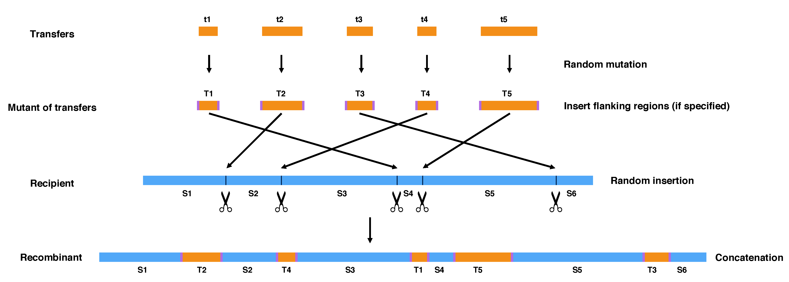
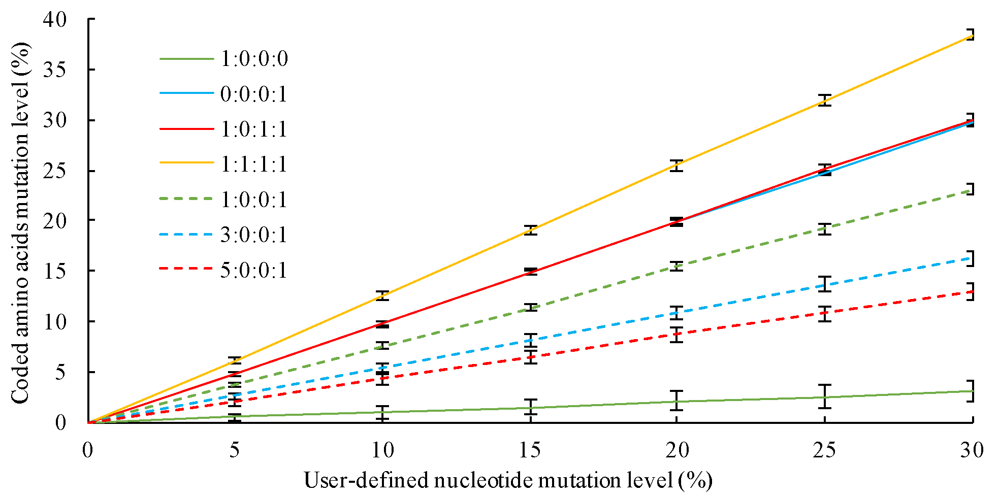

---

+ HgtSIM: A simulator for horizontal gene transfer (HGT) in microbial communities
+ Last update: 2017-10-23
+ Contact: Weizhi Song (songwz03@gmail.com), Torsten Thomas(t.thomas@unsw.edu.au)
+ Affiliation: The Centre for Marine Bio-Innovation (CMB), The University of New South Wales, Sydney, Australia

Dependencies:
---

+ [BioPython](https://github.com/biopython/biopython.github.io/)
+ [BLAST+](https://blast.ncbi.nlm.nih.gov/Blast.cgi?PAGE_TYPE=BlastDocs&DOC_TYPE=Download)

Change Log:
---
+ support for draft genome
+ support for dynamic flanking sequences
+ support for the 'mixed' mode
+ support for the 'keep_cds' option

Workflow:
---

Help information:
---

        # HgtSIM is implemented in python3, please use python3 instead of python

        python3 HgtSIM.py -h

        arguments:
          -t          sequences of genes to be transferred (multi-fasta format)
          -i          mutation level
          -d          distribution of transfers to the recipient genomes
          -f          folder holds recipient genomes
          -r          ratio of mutation types
          -x          file extension of recipient genomes
          -lf         left end flanking sequences
          -rf         right end flanking sequences
          -mixed      randomly assign mutation levels to query genes
          -mini       minimum mutation level, with "mixed" specified
          -maxi       maximum mutation level, must be smaller than 33, with "mixed"
                      specified
          -keep_cds   insert transfers only to non-coding regions, need the annotation
                      files (in gbk format) of recipient genomes
          -a          folder holds the annotation files (in gbk format) of recipient
                      genomes
          -l          the minimum length of intergenic regions to be considered for
                      insertion

Input files and arguments:
---

1. Sequences of genes to be transferred (in multi-fasta format)
1. A folder holds all recipient genomes
1. The mutation level of genes to be transferred. This can be specified either as a fixed value, or a range of values (the 'mixed' mode). If the 'mixed' argument was provided,
HgtSIM will randomly select a value between user specified minimum and maximum mutation levels to alter the query genes.

        # with fixed mutation level
        python3 HgtSIM.py -t genes.fasta -d distribution.txt -f input_genomes -r 1-0-1-1 -x fna -i 10

        # with 'mixed' mode
        python3 HgtSIM.py -t genes.fasta -d distribution.txt -f input_genomes -r 1-0-1-1 -x fna -mixed -mini 5 -maxi 25

1. The ratio of mutation categories (separated with dash). The default setting is '1-0-1-1'. Please refer to the manuscript (or the figure below) for how to set it.

        The correlation of mutation on the nucleotide level and the resulting aa changes under different mutation category ratios
1. The distribution of transfers to the recipient genomes. The first column refers to the recipient genomes(no extension), followed by a list of genes to be transferred into it (separated with comma).

        BAD,AAM_03063,AKV_01007,AMAC_01196,AMAU_02632,AMS_01785
        BDS,AAM_00175,AKV_00943,AMAC_00215,AMAU_02085,AMS_01465
        BGC,AAM_00176,AKV_01272,AMAC_01576,AMAU_00617,AMS_02653
        BHS,AAM_00195,AKV_01273,AMAC_01674,AMAU_05963,AMS_03303
        BNM,AAM_00209,AKV_00282,AMAC_02914,AMAU_02414,AMS_03378
        BRT,AAM_00308,AKV_02353,AMAC_03303,AMAU_00830,AMS_01655

1. The flanking sequences to be added to the end of genes to be transferred. Can be specified with '-lf' and '-rf', the default value is None.

        # transfers without flanking sequences
        python3 HgtSIM.py -t genes.fasta -i 10 -d distribution.txt -f input_genomes -r 1-0-1-1 -x fna

        # or, add same pair of flanking sequences (e.g. 'TAGATGAGTGATTAGTTAGTTA') to all transfers
        python3 HgtSIM.py -t genes.fasta -i 10 -d distribution.txt -f input_genomes -r 1-0-1-1 -x fna -lf TAGATGAGTGATTAGTTAGTTA -rf TAGATGAGTGATTAGTTAGTTA

        # or, add flanking sequences dynamically to the two ends of each transfer
        python3 HgtSIM.py -t genes.fasta -i 10 -d distribution.txt -f input_genomes -r 1-0-1-1 -x fna -lf lf.fasta -rf rf.fasta

    if you want to add flanking sequences dynamically to your transfers, you can specify the left and right side sequences separately in two multi-fasta files.
    The IDs of the flanking sequences need to be exactly the same to the corresponding transfers to be added.

    As an illustration, if you have four transfers, which are transfer_A, transfer_B, transfer_C and transfer_D. And you have provided the following two files to HgtSIM:

    lf.fasta

        >transfer_A
        AAAAAAAAAA
        >transfer_B
        TTT

    rf.fasta

        >transfer_A
        GGGGGGG
        >transfer_C
        CCCCC

    HgtSIM will then:
    1. add 'AAAAAAAAAA' to the left and 'GGGGGGG' to the right end of transfer_A;
    2. add 'TTT' to the left and nothing to the right end of transfer_B;
    3. add nothing to the left and 'CCCCC' to the right end of transfer_C;
    4. add nothing to boths end of transfer_D.

1. Transfers can be inserted only to the intergenic regions by specifying the 'keep_cds' option. The annotation files (in
gbk format) of the recipient genomes are needed to enable this option.

Output files:
---

1. Produced genomes with transferred genes, which were placed in folder 'Genomes_with_transfers'.
1. The amino acid sequences of input genes to be transferred.
1. The nucleotide and amino acid sequences of mutated input genes.
1. The mutation report file, which includes two parts:
    1. on the top is the nc and aa identities between input and mutated sequences for each input gene.
    1. followed by a summary of changed nucleotide bases for each input gene.
1. The insertion report file.
